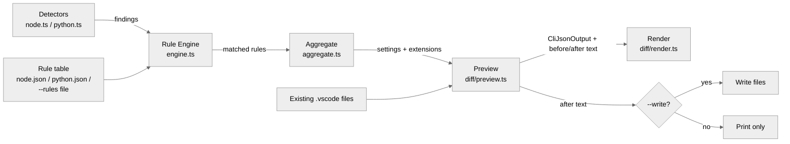

# Architecture

This document describes how `vscode-autoconfig` is put together and why. It's aimed at contributors who want to add a new ecosystem, a new rule, or change how files are merged.

## Design philosophy

- **Rule-based.** Every recommendation is traceable to an explicit condition in a JSON rule file. No inference, no guessing.
- **Additive only.** The tool never removes or overwrites a value the user already set in `.vscode/settings.json` or `.vscode/extensions.json`.
- **Dry-run first.** The default invocation only previews changes. Writing requires an explicit `--write`, and the preview is generated by running the exact same merge functions that `--write` uses — there is no separate "preview renderer" that could drift from what actually gets written.
- **Data-driven extensibility.** Supporting a new dependency (or a whole new ecosystem) should require adding data (a rule, a detector), not touching the engine.

## Data flow

1. **Detectors** (`src/detectors/`) scan the current directory only — never recursively, never `node_modules`/`.venv` — and emit a flat list of `Finding` values: "this file exists," "this package is a dependency," etc.
2. **Rules** (`src/rules/*.json`, plus anything passed via `--rules`) each declare a `when` condition over findings and, if satisfied, contribute settings and/or extension IDs.
3. The **rule engine** (`src/core/engine.ts`) is a pure function: `Finding[] + Rule[] -> matched Rule[]`. It has no knowledge of ecosystems, files, or I/O.
4. **Aggregate** (`src/core/aggregate.ts`) folds all matched rules into one settings patch and one extension list. Rules are folded in a fixed order (built-in rules, then `--rules`), first-match-wins on conflicting values, with a recorded warning rather than a silent overwrite.
5. **Preview** (`src/diff/preview.ts`) reads the existing `.vscode/settings.json` / `extensions.json` (if any), merges the aggregated patch into them, and produces a single `CliJsonOutput` object plus before/after text for each file. This is the single source of truth consumed by both the terminal renderer and `--json`.
6. Only if `--write` is passed are the "after" texts actually written to disk.

## Module map

| Path                             | Responsibility                                                                                                                                                                     |
| -------------------------------- | ---------------------------------------------------------------------------------------------------------------------------------------------------------------------------------- |
| `src/core/types.ts`              | Shared types: `Finding`, `Rule`, `RuleCondition`, `AggregatedResult`, `CliJsonOutput`. No logic.                                                                                   |
| `src/core/engine.ts`             | Matches findings against rule conditions (`all`/`any`/`not`/leaf matcher). Pure, no I/O.                                                                                           |
| `src/core/aggregate.ts`          | Folds matched rules into one settings/extensions result. Contains the only "rule vs. rule" conflict logic.                                                                         |
| `src/detectors/*.ts`             | One file per ecosystem. Reads manifests/config files from disk, emits `Finding[]`. The only place that touches ecosystem-specific parsing (`package.json`, `pyproject.toml`, ...). |
| `src/detectors/registry.ts`      | The list of active detectors. Adding an ecosystem means adding one line here.                                                                                                      |
| `src/detectors/collect.ts`       | Runs the registry, turning a failing detector into an error instead of aborting the whole run.                                                                                     |
| `src/rules/*.json`               | The actual rule content — what to recommend for what finding. Pure data.                                                                                                           |
| `src/rules/schema.ts`            | zod schema validating rule files, including the `schemaVersion` gate.                                                                                                              |
| `src/rules/loader.ts`            | Loads built-in rules (inlined at build time) and external `--rules` files (JSON/YAML, read from disk at runtime), merges or replaces per `--no-builtin-rules`.                     |
| `src/vscode/jsonc.ts`            | Thin wrapper over `jsonc-parser` — the same library VS Code itself uses — so comments and formatting in existing config files survive edits.                                       |
| `src/vscode/settings-merge.ts`   | Additive merge into `settings.json`. Depth-limited nested merge (see below).                                                                                                       |
| `src/vscode/extensions-merge.ts` | Additive union merge into `extensions.json`'s `recommendations` array.                                                                                                             |
| `src/diff/preview.ts`            | Combines detection + merge results into one `CliJsonOutput`, the single source of truth for both output formats.                                                                   |
| `src/diff/render.ts`             | Renders `CliJsonOutput` as either a terminal report or raw JSON.                                                                                                                   |
| `src/cli/args.ts`                | Commander option parsing only — no business logic.                                                                                                                                 |
| `src/cli/run.ts`                 | Orchestrates the whole pipeline above and decides the process exit code.                                                                                                           |
| `src/cli.ts`                     | CLI entry point (shebang, argument parsing, orchestration).                                                                                                                        |

## Key mechanisms worth understanding before changing them

### Nested settings merge depth

`settings-merge.ts` (file-level) and `aggregate.ts` (rule-level) both implement the _same_ depth rule, independently, because they solve the same problem at two different stages:

- An ordinary object-valued key (e.g. `files.exclude`) gets **one level** of merging: missing sub-keys are added, existing ones are left alone.
- A language-scope override key (`"[python]"`, `"[typescript]"`, ...) gets **one extra level**, because rules commonly need to reach `"[python]" → "editor.codeActionsOnSave" → "source.fixAll.ruff"`. Without this, two rules that both touch `"[python]"` (e.g. a Black rule and a Ruff rule) would collide and one would be dropped instead of merged.
- Anything deeper than that is treated as a plain value: if it already exists, it's left untouched (first-wins, recorded as skipped/conflicted).

If you need a third rule that also touches `"[python]"`, this already works — the depth logic folds across any number of rules, not just two.

### Why `CliJsonOutput` is built once

`diff/preview.ts` produces one `CliJsonOutput` object that both the terminal report and `--json` consume, and that the E2E tests assert against for idempotency (`settings.added` / `extensions.added` being empty on a second run). There is deliberately no separate code path that recomputes "what would change" for display purposes — that would risk the preview saying one thing and `--write` doing another.

### Why there's no confirmation prompt before `--write`

Earlier versions of this tool asked for an interactive Yes/No confirmation before writing, even after `--write` was passed. That was removed as redundant: the default invocation is always a dry-run, so by the time someone re-runs with `--write`, they've already seen the exact diff and made a deliberate choice to apply it. Adding a second confirmation on top re-asks the same question, and it also breaks non-interactive use (CI, scripting, `--json` consumers) by introducing a TTY-dependent prompt. Because the tool is additive-only (see "Design philosophy" above), the blast radius of a mistaken `--write` is low and easily undone — unlike genuinely destructive operations, a second safety gate wasn't earning its complexity. `--write` itself is the confirmation, matching the `git clean -n` → `git clean -f` style of dry-run-then-force-flag tools.

### Extending to a new ecosystem

1. Add `src/detectors/<ecosystem>.ts` implementing the `Detector` interface (`ecosystem`, `detect(ctx): Finding[]`). Only read files directly under `ctx.cwd`; never recurse into subdirectories.
2. Add `src/rules/<ecosystem>.json` with `schemaVersion: 1` and a `rules` array.
3. Register the detector in `src/detectors/registry.ts`.
4. Nothing in `core/`, `vscode/`, `diff/`, or `cli/` needs to change.
